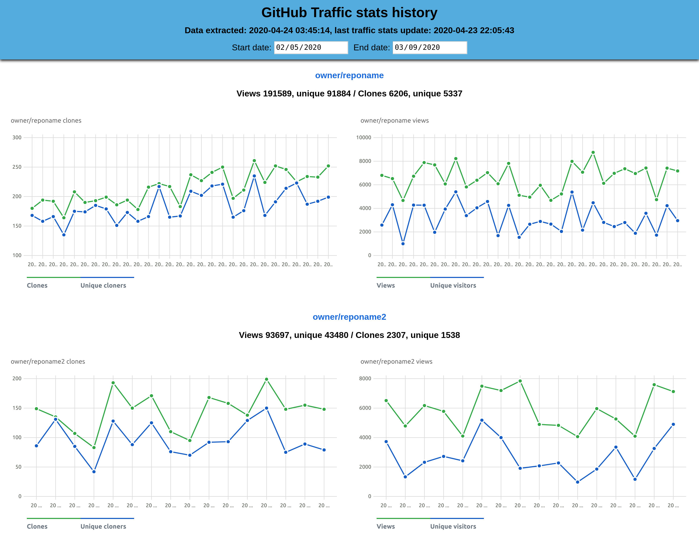

# GitHub Traffic Stats Backup Tool

A tool to make backups and keep practically unlimited history of GitHub traffic stats



In particular, allows to maintain a traffic stats history of more than 14 days (which, turns out, is the maximum that GitHub allows to access currently).

The code was meant to be very simple, extensible and, when needed, quickly editable. Should be relatively easy to adapt.

Currently the script stores data on views, clones (total and unique), top 10 referrers and top 10 paths per repository (from past 14 days) as provided by GitHub API. This is data from Insights/Traffic on GitHub (`graphs/traffic` repository section). When scheduled to run regularly, for instance with `cron`, it should maintain all relevant traffic stats history that was available per repository.

By default, timestamped JSON files are saved in `save_stats/` directory and script output logs stored in `logs/`. Upserted sqlite db is stored in `save_stats/` and its backups in `db_backup/`.

Possible improvements:

* Add different handlers, including upserting into a database (small in-file SQLite db) Done
* Normalize/deduplicate data (left like that, it might be simpler and faster to search/grep through when using such flat redundant structure)
* Add simple frontend with graphs like on GitHub but with all data available Done

The script uses an elegant Python GitHub API wrapper [https://github.com/PyGithub/PyGithub](https://github.com/PyGithub/PyGithub) and Frappe Charts for displaying traffic charts [https://frappe.io/charts](https://frappe.io/charts)

GitHub API documentation: [https://developer.github.com/v3/](https://developer.github.com/v3/) and [documentation](https://developer.github.com/v3/repos/traffic/) of REST endpoint for `repos/traffic`.


### Usage

Clone the repo
```
git clone https://github.com/lukasz-fiszer/github-traffic-stats.git
cd github-traffic-stats
```

Create a virtual environment and install dependencies:
```
python -m venv venv/
. venv/bin/activate
pip install -r requirements.txt
```

Fill in the `config.json` file
```json
{
    "github-token": "[github-token]",
    "github-user": "[github-user-login]"
}
```

Test run
```
./runner.sh
```

Set up a `cron` job or `anacron` job, etc
```
# run github-traffic-stats named anacron job daily, using runner.sh in the repo directory
echo '1 5 github-traffic-stats $(cd /path/to/repo; ./runner.sh)' | sudo tee -a /etc/anacrontab
```

To check traffic charts with index.html  
After collecting traffic data, extract it to a js file
```
python FrontendDataExtractor.py
```
Open the dashboard with traffic stats
```
xdg-open frontend/index.html
```

